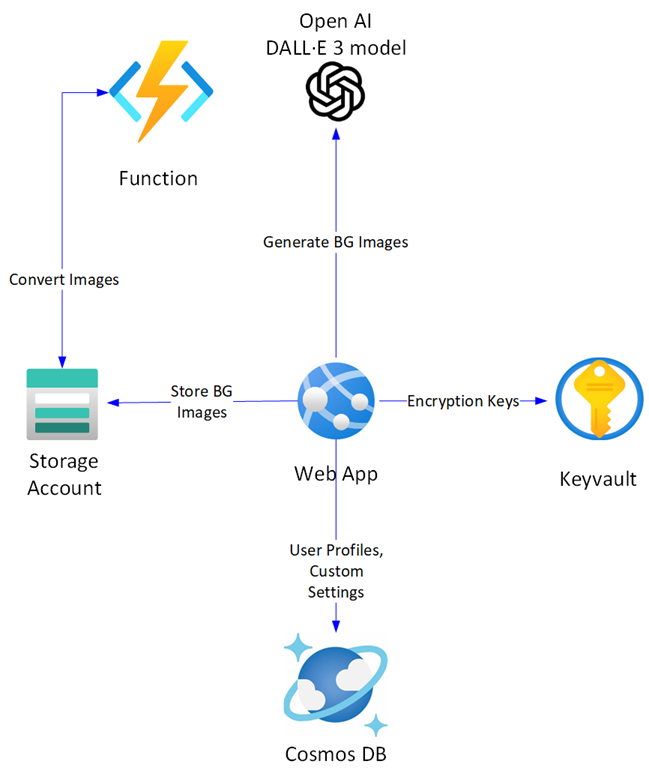

## Project description

The "MCT Timer" project is an innovative tool designed to assist the Microsoft Certified Trainer (MCT) community. It simplifies the process of setting up and managing timers for classroom sessions directly from a web page. This project aims to enhance the teaching and learning experience by providing a seamless way to notify learners when classes resume.

### Project Hosting
The MCT Timer is hosted on a robust and reliable platform, the Microsoft Azure Web App. This ensures that the service is scalable, secure, and always available for users. The project is managed and maintained by the Microsoft Trainers Team, who bring their expertise and dedication to ensure its smooth operation and continuous improvement.

One of the core principles of the MCT Timer project is accessibility. The website is publicly accessible, meaning anyone can use it without any restrictions. Moreover, the service is provided free of charge, making it an invaluable resource for the MCT community and beyond.

### Features and Benefits
- Easy Setup: The web interface is user-friendly, allowing trainers to quickly set up timers with minimal effort.
- Real-Time Notifications: Learners are promptly informed when classes will resume, ensuring that everyone stays on schedule.
- Public Access: The site is accessible to all, fostering a collaborative and inclusive learning environment.
- Cost-Free: The service is provided at no cost, removing any financial barriers to its use.
- Background customization: The service will allowed to upload personal background for different timers and generate custom background with Open AI model DALE


## Architecture

The project are contains from following resources deploy in Azure.  
- Azure App Services used for hosting ASP core MVC project. 
- Azure Cosmos DB is used to persist metadata and information about customized settings and user profiles and user generated backgrounds.
- Azure Storage account will be used for persisting customized images. 
- Azure Function will be used for compression and conversion of customized images. 
- Azure Keyvault is used to persist cryptography keys for encrypt user's sensitive information.
- Azure Open AI service provisioned DALE3 model that used for image generation.




## Configuration

For local exaction the configuration file should be provided with following template: 

```JSON
{
  "Logging": {
    "LogLevel": {
      "Default": "Information",
      "Microsoft.AspNetCore": "Warning"
    }
  },
  "ConfigMng": {
    "OpenAIEndpoint": "https://<your service>.openai.azure.com/",
    "OpenAIKey": "<your key copied from portal>",
    "OpenAIModel": "<name of the dale model>",
    "StorageAccountString": "<Connection string to your account>",
    "Container": "<cosmos db container name for images>",
    "JWT": "<generated token to encrypt jwt>",
    "KeyVault": "<keyvault address>",
    "PssKey": "<key name>"
  },
  "ApplicationInsights": "<cs copy from AI page>",  
  "AllowedHosts": "*",
  "ConnectionStrings": {
    "WebSettingsContext": "<connection string to cosmos db>",
    "UsersContext": "<connection string to cosmos db>"

  }
}
````

If you tend to use Managed Identity you need provide Role 'Key Vault Crypto User' for the web site account. 