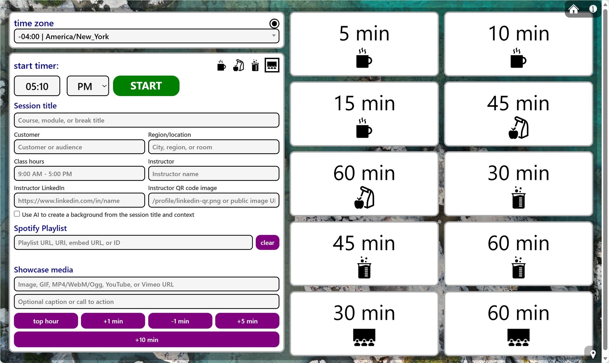
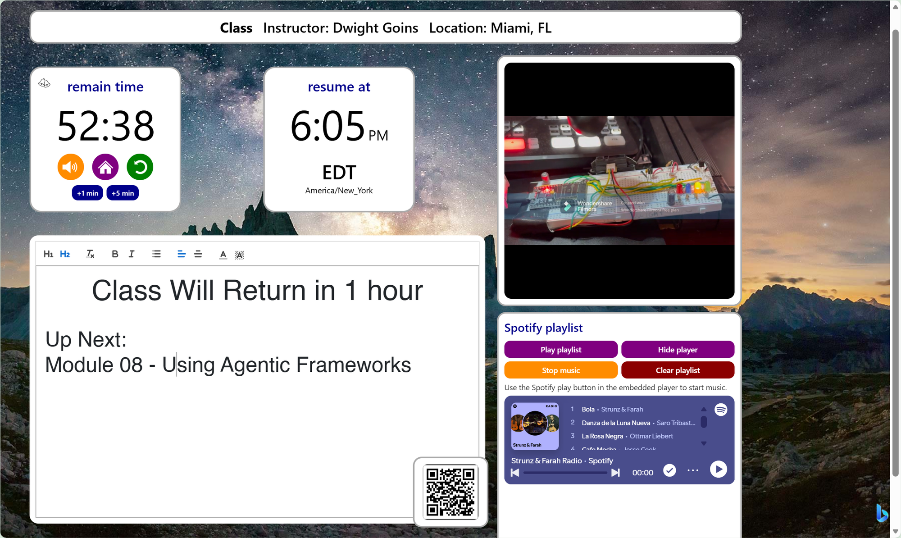
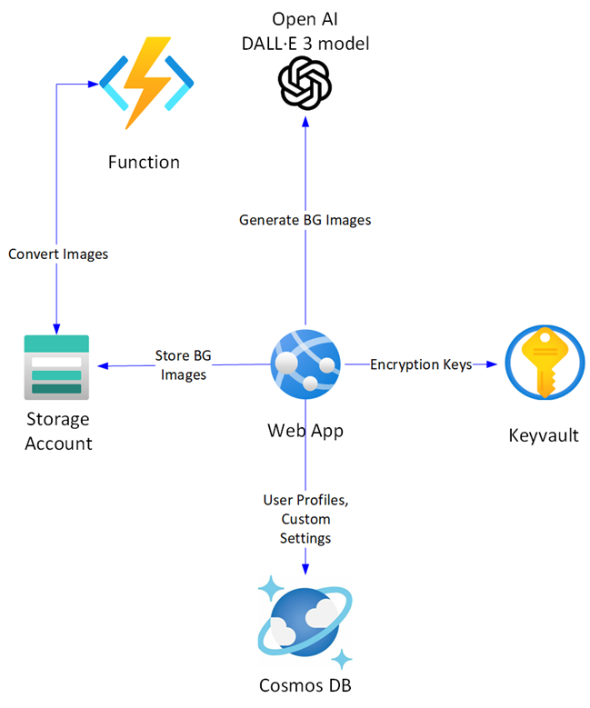

## Project description

[](https://github.com/dngoins/mct-timer/actions/workflows/azure-webapps-dotnet-core.yml)

The "MCT Timer" projectis an innovative tool designed to assist the Microsoft Certified Trainer (MCT) community. It simplifies the process of setting up and managing timers for classroom sessions directly from a web page. This project aims to enhance the teaching and learning experience by providing a seamless way to notify learners when classes resume.

### Project Hosting
The MCT Timer can be hosted on Azure Container Apps using the infrastructure and GitHub Actions workflow included in this repository. This keeps the app deployable without an Azure App Service Plan while still using managed Azure services for storage, identity, data, and monitoring.

One of the core principles of the MCT Timer project is accessibility. The website is publicly accessible, meaning anyone can use it without any restrictions. Moreover, the service is provided free of charge, making it an invaluable resource for the MCT community and beyond.

### Features and Benefits
- Easy Setup: The web interface is user-friendly, allowing trainers to quickly set up timers with minimal effort.
- Real-Time Notifications: Learners are promptly informed when classes will resume, ensuring that everyone stays on schedule.
- Public Access: The site is accessible to all, fostering a collaborative and inclusive learning environment.
- Cost-Free: The service is provided at no cost, removing any financial barriers to its use.
- Background customization: The service will allowed to upload personal background for different timers and generate custom background with Open AI model DALE
- Spotify playlist support: Trainers can attach a public Spotify playlist to a timer session and play it from the countdown page.




The countdown page shows the remaining time and resume-at clock, the trainer's main message, an optional showcase video (top right), and an embedded Spotify playlist player (bottom right) when a playlist has been attached to the session.




## Architecture

The project contains the following resources deployed in Azure:
- Azure Container Apps hosts the ASP.NET Core MVC project.
- Azure Container Registry stores the application container image.
- Azure Cosmos DB is used to persist metadata and information about customized settings and user profiles and user generated backgrounds.
- Azure Storage account will be used for persisting customized images. 
- Azure Keyvault is used to persist cryptography keys for encrypt user's sensitive information.
- Azure Open AI service provisioned DALE3 model that used for image generation.



## Spotify Playlist Support

Timer setup includes an optional **Spotify Playlist** field. Paste a public Spotify playlist URL, Spotify playlist URI, Spotify embed URL, or raw playlist ID before starting a timer. The timer stores only the normalized playlist embed URL in the timer session URL; it does not use Spotify credentials, OAuth, private APIs, or paid API features.

Supported input formats:

- `https://open.spotify.com/playlist/{playlistId}`
- `https://open.spotify.com/playlist/{playlistId}?si=abc123`
- `spotify:playlist:{playlistId}`
- `https://open.spotify.com/embed/playlist/{playlistId}`
- `{playlistId}`

The countdown page shows a Spotify embedded playlist player when a playlist is provided. Music does not autoplay on page load; use **Play playlist** and then the Spotify play button inside the embedded player. Use the countdown page controls to show or hide the player, stop playback, or clear the playlist from the timer session. When the timer reaches zero, the embedded player is reset so music does not continue unnoticed.

## Session Details and Showcase Media

Timer setup can include optional session details that travel with the timer URL: session title, customer name, region/location, class hours, instructor name, and instructor LinkedIn or QR-code image links. The countdown page displays those details in a slim header above the timer and can show instructor profile links at the bottom of the screen. A bundled LinkedIn QR image is available at `/profile/linkedin-qr.png` and is publicly served by the app when deployed.

The setup page also supports:

- AI-generated background: creates a one-off background from the session title and context when Azure OpenAI image generation is configured. If configuration is missing or generation fails, the timer shows a friendly message and keeps the standard background.
- Feeling lucky Bing background: loads the latest Bing image of the day on each countdown page refresh.
- Custom background upload: pick a PNG, JPEG, or WebP image (up to 4 MB) from the setup page. When provided, the uploaded image is used as the countdown background and overrides both the Bing daily image and AI-generated backgrounds. Uploads are saved under `wwwroot/uploads/session/` with a randomized name and are not associated with any user account.
- Showcase media: displays an image, animated GIF, video file, YouTube video, or Vimeo video above the message editor for advertisements, upcoming topics, references, or instructor promotional content. Media must be a public URL; local file paths must be uploaded or hosted first. Videos autoplay muted when browser policy allows it.
- Quick countdown controls: **+1 min** and **+5 min** buttons on the countdown page extend the active timer without restarting the session.


## Configuration

For local execution the configuration file should be provided with following template:

```JSON
{
  "Logging": {
    "LogLevel": {
      "Default": "Information",
      "Microsoft.AspNetCore": "Warning"
    }
  },
  "ConfigMng": {
    "OpenAIEndpoint": "https://<your service>.openai.azure.com/",
    "OpenAIKey": "<your key copied from portal>",
    "OpenAIModel": "<name of the DALL-E image deployment>",
    "StorageAccountName": "<your storage account name>",
    "ContainerName": "<blob container name for images, usually $web>",
    "JWT": "<generated token to encrypt jwt>",
    "KeyVault": "<keyvault address>",
    "PssKey": "<key name>",
    "FileSizeLimit": "max file size in bite (int)",
    "WebCDN": "url of static website created for storage account",
    "CosmosDBEndpoint": "https://<your cosmos acc name>.documents.azure.com:443/",
    "TenantID": "<your tenant guid>",
    "SubscriptionID": "<your subscription guid>",
    "PwdResetRequestUrl": "https://..."          

  },
  "ApplicationInsights": {
    "ConnectionString": "<connection string copied from Application Insights>"
  },
  "AllowedHosts": "*"
}
````

## Deploy to your Azure subscription with GitHub Actions

This repository includes Bicep infrastructure in `infra/` and a GitHub Actions workflow in `.github/workflows/azure-webapps-dotnet-core.yml`. The workflow uses GitHub OpenID Connect (OIDC) with Microsoft Entra ID, so you do not need to store an Azure publish profile or Azure password in GitHub.

The workflow provisions:

- Azure Container Apps for the ASP.NET Core web app
- Azure Container Registry for the application image
- Application Insights and Log Analytics
- Azure Cosmos DB for NoSQL database `webapp` and container `Users`
- Azure Storage static website container for uploaded/generated backgrounds
- Azure Key Vault with an RSA key for password encryption
- Managed identity and RBAC assignments for the container app

The storage account enables static website hosting for the `$web` background image container during the GitHub Actions workflow after ARM provisioning creates the account. That requires blob public access to be enabled at the storage account level, and the workflow passes the resulting static website endpoint into the Container App configuration for public background delivery.

### 1. Create the Microsoft Entra app registration

Run these commands from Azure Cloud Shell or a local terminal with Azure CLI. Replace `<owner>` and `<repo>` with your GitHub owner and repository name, and keep the environment name aligned with the GitHub environment used by the workflow, for example `dev`.

```bash
az login
az account set --subscription "<your-subscription-id>"

SUBSCRIPTION_ID=$(az account show --query id -o tsv)
TENANT_ID=$(az account show --query tenantId -o tsv)
APP_ID=$(az ad app create --display-name "mct-timer-github" --query appId -o tsv)
az ad sp create --id "$APP_ID"
SP_OBJECT_ID=$(az ad sp show --id "$APP_ID" --query id -o tsv)
```

### 2. Add the federated identity credential

Create a file named `credential.json`:

```json
{
  "name": "github-dev-environment",
  "issuer": "https://token.actions.githubusercontent.com",
  "subject": "repo:<owner>/<repo>:environment:dev",
  "description": "Allow GitHub Actions from the dev environment to deploy MCT Timer",
  "audiences": [
    "api://AzureADTokenExchange"
  ]
}
```

Then attach it to the app registration:

```bash
az ad app federated-credential create \
  --id "$APP_ID" \
  --parameters credential.json
```

If you use a different GitHub environment name, update both the workflow environment and the `subject` value. If you deploy from multiple environments, add one federated credential per environment.

### 3. Assign Azure roles to the GitHub deployment identity

The workflow creates a resource group, provisions Bicep resources, builds the container image in Azure Container Registry, and creates RBAC assignments for the container app managed identity. For a fully automated first deployment, assign these roles at subscription scope:

```bash
SCOPE="/subscriptions/$SUBSCRIPTION_ID"

az role assignment create \
  --assignee-object-id "$SP_OBJECT_ID" \
  --assignee-principal-type ServicePrincipal \
  --role "Contributor" \
  --scope "$SCOPE"

az role assignment create \
  --assignee-object-id "$SP_OBJECT_ID" \
  --assignee-principal-type ServicePrincipal \
  --role "Role Based Access Control Administrator" \
  --scope "$SCOPE"
```

After the first deployment, you can reduce scope to the created resource group if you do not need the workflow to create new resource groups.

### 4. Configure GitHub secrets and variables

In your GitHub repository, create these **Actions secrets**:

| Secret | Value |
|--------|-------|
| `AZURE_CLIENT_ID` | `$APP_ID` from the app registration |
| `AZURE_TENANT_ID` | `$TENANT_ID` |
| `AZURE_SUBSCRIPTION_ID` | `$SUBSCRIPTION_ID` |
| `JWT_SECRET` | Strong random value used by the app for JWT/ALTCHA signing |
| `AZURE_OPENAI_ENDPOINT` | Optional Azure OpenAI endpoint. Required for AI background generation. |
| `AZURE_OPENAI_KEY` | Optional Azure OpenAI key. Required for AI background generation. |
| `PWD_RESET_REQUEST_URL` | Optional password reset email endpoint |

Create these **Actions variables**:

| Variable | Value |
|----------|-------|
| `AZURE_ENV_NAME` | `dev` or another short environment name |
| `AZURE_LOCATION` | Azure region, for example `eastus2` |
| `AZURE_OPENAI_MODEL` | Optional image model deployment name, for example `dall-e-3`. Required for AI background generation. |

AI background generation uses an existing Azure OpenAI image deployment; the deployment workflow does not create Azure OpenAI capacity for you. Leave these settings empty to disable AI backgrounds, or set the endpoint, key, and deployment name to enable the checkbox on the timer setup page.

### 5. Run the deployment workflow

Push to `main`, or run **Provision and deploy MCT Timer** from the GitHub Actions tab. The manual workflow lets you override `environmentName` and `location`.

The workflow runs tests, provisions Bicep infrastructure, builds the .NET 10 container image with ACR Tasks, pushes it to Azure Container Registry, and updates the Azure Container App with the new image tag.

### Container Apps and registry quota notes

This deployment no longer creates an App Service Plan, so App Service worker quota is not required. Azure Container Apps and Azure Container Registry can still be subject to regional availability, subscription policy, or resource provider registration requirements.

Fix it by doing one of the following:

- Run the workflow in another Azure region by changing `AZURE_LOCATION`.
- Register the required resource providers: `Microsoft.App`, `Microsoft.ContainerRegistry`, `Microsoft.OperationalInsights`, `Microsoft.DocumentDB`, `Microsoft.Storage`, and `Microsoft.KeyVault`.
- If Container Apps capacity is unavailable in a region, choose a nearby region with Container Apps support.

## .NET Aspire local orchestration

The solution includes an Aspire AppHost project in `mct-timer.AppHost/`. Use it for local orchestration and Aspire dashboard support:

```bash
dotnet run --project ./mct-timer.AppHost/mct-timer.AppHost.csproj
```

Production deployment uses Azure Container Apps so the app does not depend on Azure App Service.

## Security Config

The deployed container app uses a user-assigned managed identity with `DefaultAzureCredentialOptions`.
Local runs should be implemented behalf of the VS login user. Alternatively you can use App registration and configure local environment variables described in the following [link](https://learn.microsoft.com/en-us/dotnet/azure/sdk/authentication/local-development-service-principal?tabs=azure-cli%2Cwindows%2Ccommand-line#4---set-application-environment-variables)

For Keyvault connection you have to configure role 'Key Vault Crypto User' for the container app managed identity and test account.
For cosmos DB we recommend use RBAC assignment as explained in the following doc. By now custom role need to be manualy assigned as explained in following [link](https://learn.microsoft.com/en-us/azure/cosmos-db/how-to-setup-rbac#metadata-requests)

